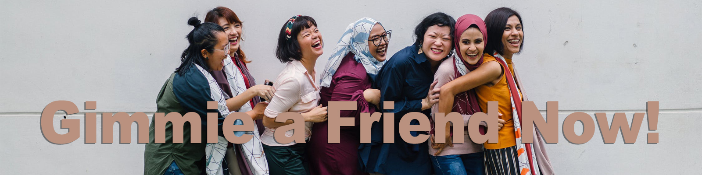
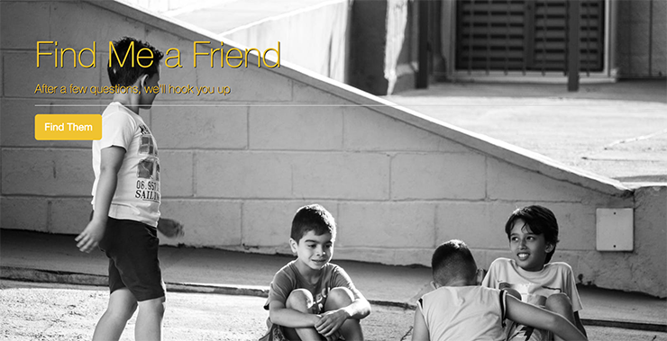

Need a friend right now? Instant. You get what you get. No do-overs. When you're done, take your new best friend and go do something. The algorithm is never wrong.


## Live Link
 - https://friend-finder-becoskie.herokuapp.com/

## Usage



Go to the homepage and fill out the state-of-the-art survey. After submitting the survey, your new best friend forever will pop up. Also there is an API so you can see who we didn't pick for you.

## Features
- Separate files for server logic, data, views, and routing
- 10-question survey to dial in the user
- Use `express`, `body-parser`, and `path` npm packages in the `server.js` file
- Separate JavaScript files for routing (`htmlRoutes.js` and `apiRoutes.js`)
- GET and POST routes for serving HTML pages
- Calculate best match for user once survey is completed and return that match to the user

## The Build

- JavaScript
- jQuery
- node.js
- Express.js
- HTML
- Bootstrap

## Code
- The `server.js` file sets up the Express server, the port for both local and `keroku`deployment, npm packages that need to be loaded, and the approproate routes
- There are 2 separate HTML files (`home.html` and `survey.html`) that serve as the front-end portion of our code; the ui.
- The 2 routing files (`htmlRoutes.js` and `apiRoutes.js`) determine the back-end logic (based on the request being made, the response that gets sent to the browser); the HTML routes display the survey and the homepage based on the URL that is accessed, and the API routes send back existing content in our server-side data or add new friends
- Best match is calculated by finding the friend with the minimal difference in scores and then sending that data to the browser as a JSON object
- A modal is then toggled, displaying the the best match to the person who just took the survey

```js
{
	name: "Fulton",
	photo: "https://images.pexels.com/photos/242829/pexels-photo-242829.jpeg?auto=compress&cs=tinysrgb&dpr=2&h=750&w=1260",
	scores: [5, 1, 2, 3, 1, 2, 5, 1, 1, 1]
}
```

### Someday someone will, I know it in all my heart. 
<a class="bmc-button" target="_blank" href="https://www.buymeacoffee.com/mwFGJN9bZ"></a>